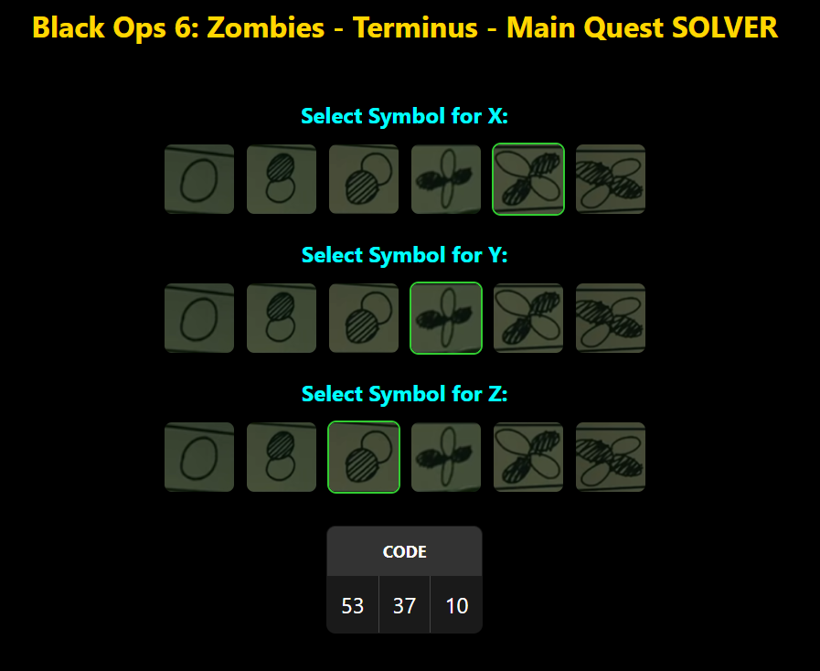
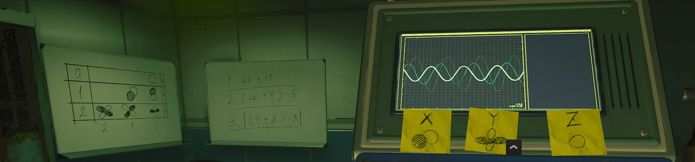

# Black Ops 6: Zombies - Terminus - Main Quest Solver

This is a web-based application designed to help players solve the main quest for the Zombies mode in the game Call of Duty Black Ops 6. It computes values based on selected symbols and provides results in real-time. 

 

### Introduction

I created this as a fun and accessible way to introduce young folks to algorithms and programming. The puzzle’s simple logic and straightforward calculations make it ideal for coding in various languages, providing a hands-on introduction to core programming concepts.

I’ll be creating a few forks of this project to showcase implementations in different languages. These can be used as an introduction for courses or personal projects. If you’re looking to explore programming fundamentals, feel free to check out the forks on how this puzzle can be approached across multiple languages!

## Features

- **Real-time Calculation**: Results are computed instantly as you select symbols for X, Y, and Z.
- **User-Friendly Interface**: Designed to be mobile-friendly with an intuitive layout and easy-to-understand results table.
- **Dynamic Symbol Selection**: Users can select symbols that correspond to unique values, which are then used in predefined mathematical formulas.

## Setup Instructions

1. **Place Symbol Images**: Ensure the following PNG files are in the same directory as the HTML file:
   - `0.png`, `10.png`, `11.png`, `20.png`, `21.png`, `22.png`
   - Each file name corresponds to the initial values used in the calculations (e.g., `0.png` represents 0, `10.png` represents 10, etc.).

2. **Open the HTML File**:
   - Open the HTML file (`index.html`) in a web browser. It’s compatible with most modern browsers and is responsive for mobile devices.

3. **Use the Application**:
   - Select symbols for X, Y, and Z by clicking on the images. The app will automatically compute and display the results.

## Math Behind the Solver

The app calculates three specific expressions based on values assigned to variables **X**, **Y**, and **Z**, corresponding to selected images.

### Expressions

1. **Line 1**: `2X + 11`
   - This formula doubles the value of **X** and then adds 11.

2. **Line 2**: `(2Z + Y) - 5`
   - This formula doubles **Z**, adds **Y**, and subtracts 5.

3. **Line 3**: `(Y + Z) - X`
   - This formula adds **Y** and **Z** together, then subtracts **X**.

Each result is displayed as the absolute value to ensure positive numbers, as negatives cannot be input in the puzzle we're solving.

### Example Calculation

If **X** = 10, **Y** = 20, and **Z** = 5:

- **Line 1**: `2(10) + 11 = 31`
- **Line 2**: `(2(5) + 20) - 5 = 25`
- **Line 3**: `(20 + 5) - 10 = 15`

The results would display as: 

- Code: 31 ; 25 ; 15

## Modifying Symbol Values

If the values associated with the symbols change, update the `symbols` array in the JavaScript section:

```javascript
const symbols = ['new_value1', 'new_value2', 'new_value3', 'new_value4', 'new_value5', 'new_value6'];
```

Make sure that the PNG file names match the values in the symbols array to ensure accurate calculations.

## Puzzle Explanation

In-game, this puzzle involves decoding a set of three equations using values associated with symbols on sticky notes. Here’s how it works:

 

1. **Right Whiteboard (Equations)**:
   - The right whiteboard displays three equations labeled `1`, `2`, and `3`.
   - Each equation provides a number that must be entered into the computer. The number from:
     - **Equation 1** will be the 1st entry,
     - **Equation 2** will be the 2nd entry,
     - **Equation 3** will be the 3rd entry.

2. **Computer Sticky Notes (Symbols for X, Y, Z)**:
   - The computer has three sticky notes, each showing a symbol that represents a missing value: **X**, **Y**, or **Z**.
   - You need to determine the values of **X**, **Y**, and **Z** based on these symbols.

3. **Left Whiteboard (Symbol Key for X, Y, Z)**:
   - The left whiteboard is a symbol key that decodes each symbol into a two-digit number based on a grid of three rows and three columns.
   - Each **X**, **Y**, or **Z** value consists of two digits, decoded as follows:
     - The **first digit** is based on the row number (0, 1, or 2).
     - The **second digit** is based on the column number (2, 1, or 0).
   - For example:
     - If the symbol shows a white circle in the top-left position, this corresponds to `00` (row 0, column 0).
     - Possible numbers are: `00`, `12`, `11`, `10`, `22`, `21`, and `20`.

4. **Solving the Equations**:
   - After determining the values for **X**, **Y**, and **Z** using the left whiteboard, return to the right whiteboard to solve each equation.
   - For example:
     - Given the equation `(2Z + Y) - 5` where **Z = 10** and **Y = 22**, the solution would be:
       ```
       (2 * 10 + 22) - 5 = 37
       ```

5. **Entering the Solution**:
   - After solving all three equations, input each result in the correct order into the computer.


