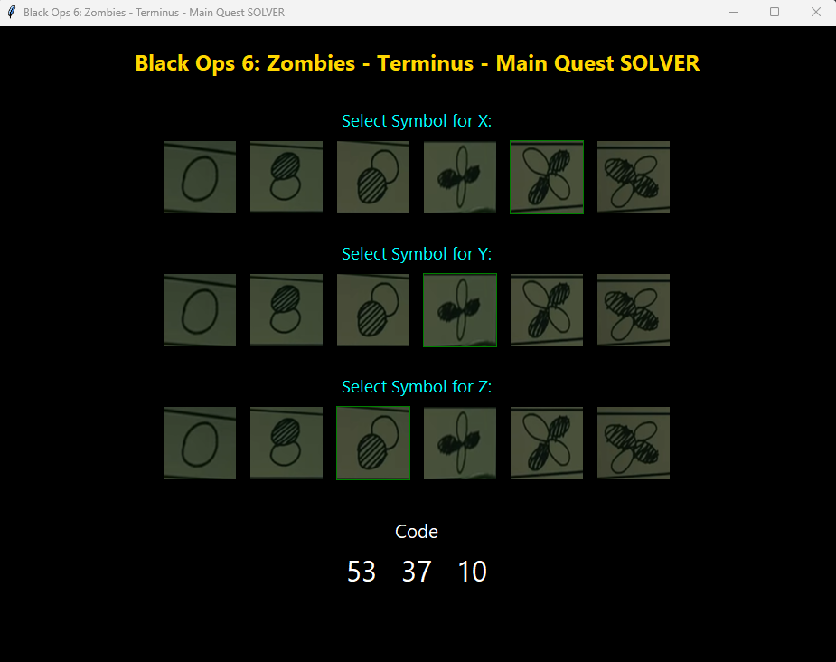

# Black Ops 6: Zombies - Terminus - Main Quest Solver

This is a Python application designed to help players solve the main quest for the Zombies mode in the game Call of Duty Black Ops 6. It computes values based on selected symbols and provides results in real-time. 

 

### Introduction

This Python app replicates the functionality of the BO6-Terminus-Solver, allowing users to select symbols for variables X, Y, and Z, and computes three expressions based on these selections. The app provides a graphical user interface (GUI) using Tkinter, Python's standard GUI toolkit.

## Puzzle Explanation

In-game, this puzzle involves decoding a set of three equations using values associated with symbols on sticky notes. Here’s how it works:

 

1. **Right Whiteboard (Equations)**:
   - The right whiteboard displays three equations labeled `1`, `2`, and `3`.
   - Each equation provides a number that must be entered into the computer. The number from:
     - **Equation 1** will be the 1st entry,
     - **Equation 2** will be the 2nd entry,
     - **Equation 3** will be the 3rd entry.

2. **Computer Sticky Notes (Symbols for X, Y, Z)**:
   - The computer has three sticky notes, each showing a symbol that represents a missing value: **X**, **Y**, or **Z**.
   - You need to determine the values of **X**, **Y**, and **Z** based on these symbols.

3. **Left Whiteboard (Symbol Key for X, Y, Z)**:
   - The left whiteboard is a symbol key that decodes each symbol into a two-digit number based on a grid of three rows and three columns.
   - Each **X**, **Y**, or **Z** value consists of two digits, decoded as follows:
     - The **first digit** is based on the row number (0, 1, or 2).
     - The **second digit** is based on the column number (2, 1, or 0).
   - For example:
     - If the symbol shows a white circle in the top-left position, this corresponds to `00` (row 0, column 0).
     - Possible numbers are: `00`, `12`, `11`, `10`, `22`, `21`, and `20`.

4. **Solving the Equations**:
   - After determining the values for **X**, **Y**, and **Z** using the left whiteboard, return to the right whiteboard to solve each equation.
   - For example:
     - Given the equation `(2Z + Y) - 5` where **Z = 10** and **Y = 22**, the solution would be:
       ```
       (2 * 10 + 22) - 5 = 37
       ```

5. **Entering the Solution**:
   - After solving all three equations, input each result in the correct order into the computer.


